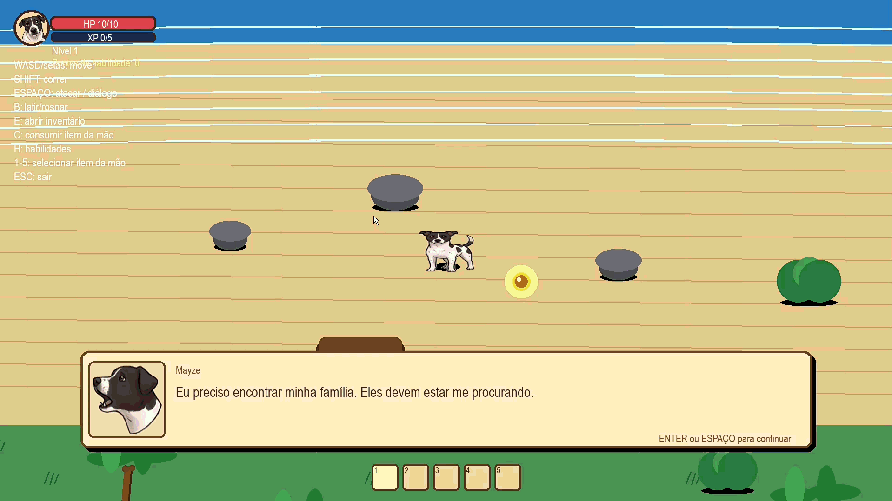

# MayzePraiaDasLembrancas
Este game é um RPG de ação 2D top-down, onde você controla a cachorrinha Mayze, que acordou perdida numa praia e precisa achar sua família. Tem combate, inimigos, inventário, XP/níveis e árvore de habilidades.

````markdown
main.py              → ponto de entrada (execute: .venv\Scripts\python.exe main.py)
src/config.py        → ajustes de jogo e caminhos de recursos
src/game.py           → coordenação do ciclo principal e das telas
src/maps/             → mapas, câmera e objetos do cenário
src/player/           → personagem, movimentação, combate, inventário e habilidades
src/enemies/          → inimigo base e tipos específicos
src/ui/               → componentes de interface (HUD, hotbar, minimapa e objetivos)
src/systems/          → regras reutilizáveis, como experiência/níveis
assets/               → imagens e demais recursos do jogo
````

Os valores de balanceamento ficam em `src/config.py`, e não em variáveis de
ambiente: fazem parte das regras versionadas do jogo e devem ter o mesmo valor
em desenvolvimento e distribuição. Use uma `.env` apenas para segredos ou
configurações específicas da máquina.


